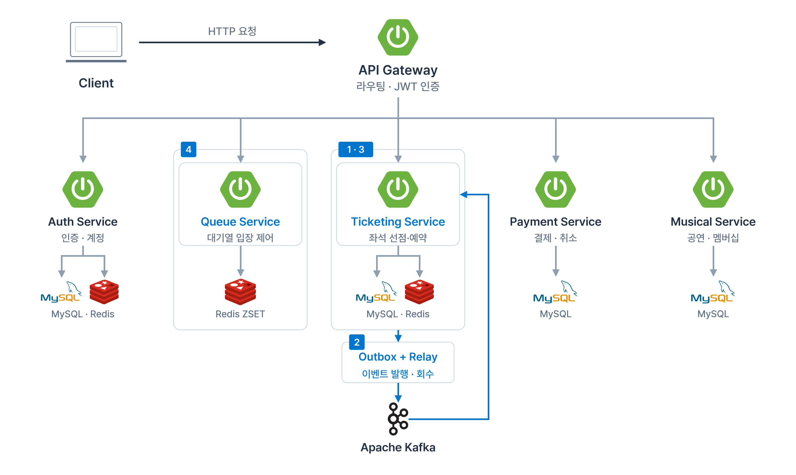
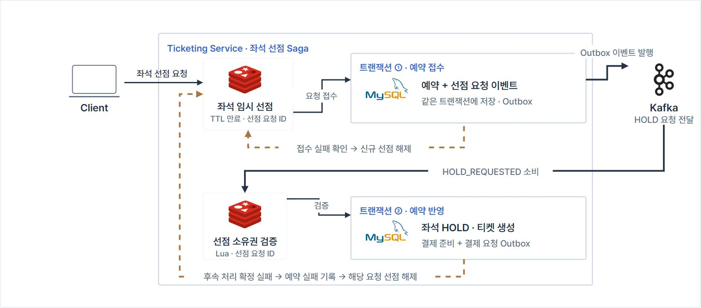
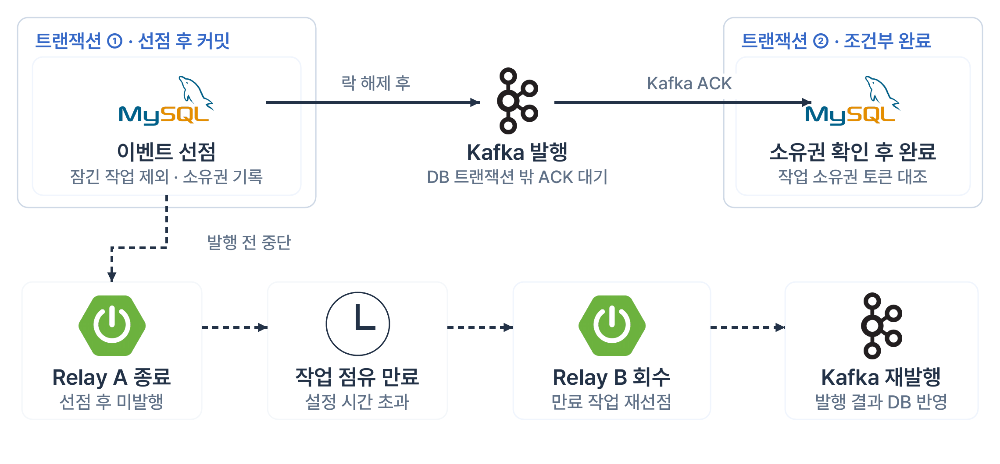
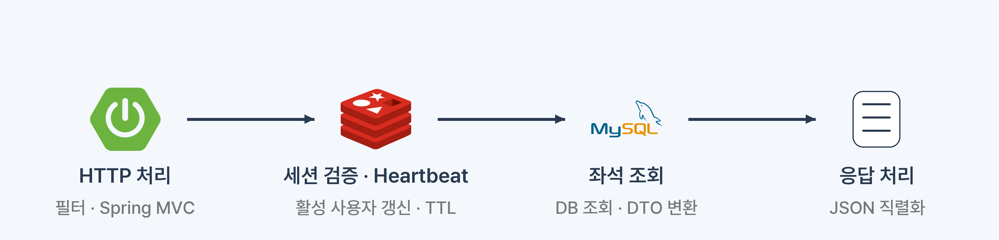
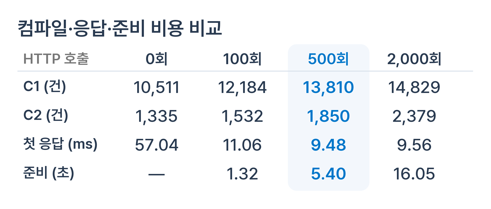

# Truve | 뮤지컬 티켓팅 BE 프로젝트

> 팀 프로젝트로 개발한 뮤지컬 예매 서비스를 바탕으로, <br>좌석 선점의 실패 처리와 이벤트 발행 복구, 초기 요청 지연을 개선하고 있습니다.

**개인 작업 · Saga · Transactional Outbox · JVM Warm-up · Redis 대기열**

[원본 팀 저장소](https://github.com/pain22value/back)

Truve는 뮤지컬 팬덤을 위한 예매 서비스입니다. <br> 대기열 입장부터 좌석 선택, 예약, 결제로 이어지는 흐름을 서비스별로 나누어 구성했습니다.

예매 과정에서 일부 처리가 실패하거나 요청이 재전달되어도 상태가 어긋나지 않도록 처리 흐름을 보완하고 있습니다. <br>
팀 프로젝트의 전체 기능과 협업 기록은 위 원본 저장소에서 확인할 수 있습니다.

## 서비스 구조



그림의 ①~④는 아래 개인 핵심 작업에 대응합니다. Kafka 흐름은 좌석 선점과 Outbox를 중심으로 표시했습니다.

<table align="center">
  <thead><tr><th align="center">모듈</th><th align="center">역할</th></tr></thead>
  <tbody>
    <tr><td align="center"><code>api-gateway</code></td><td align="center">요청 라우팅, JWT 인증 필터</td></tr>
    <tr><td align="center"><code>auth-server</code></td><td align="center">회원·인증·토큰 관리</td></tr>
    <tr><td align="center"><code>queue</code></td><td align="center">대기 순번, 입장 토큰, 입장 대상 선정</td></tr>
    <tr><td align="center"><code>ticketing</code></td><td align="center">티켓팅 세션, 좌석 선점, 예약 상태, Outbox 발행</td></tr>
    <tr><td align="center"><code>payment</code></td><td align="center">결제 승인·취소, 결제 이벤트 처리</td></tr>
    <tr><td align="center"><code>musical</code></td><td align="center">공연·캐스팅·아티스트 정보</td></tr>
    <tr><td align="center"><code>common</code> / <code>common-observability</code></td><td align="center">공통 코드, 로깅·메트릭 설정</td></tr>
  </tbody>
</table>

**주요 기술:** Java 21, Spring Boot, Spring Cloud Gateway, Spring Data JPA, MySQL, Redis, Apache Kafka, Docker Compose
<br>

## 개인 핵심 작업

### ① Saga 기반 좌석 선점과 보상

Redis에서 좌석을 선점한 뒤 DB 예약 저장이 실패하면 예약 없이 좌석만 점유될 수 있습니다. <br>
반대로 커밋 여부가 불확실한 상황에서 즉시 선점을 해제하면, 이미 저장된 예약의 좌석을 다른 요청이 가져갈 수 있습니다.

이를 다루기 위해 **예약 접수와 후속 반영을 분리하고, 실패가 확인된 요청에 한해 소유권을 검증하여 보상**하도록 구성했습니다.



1. Redis에 선점 요청 ID와 TTL을 기록하고, DB에는 예약과 `HOLD_REQUESTED` Outbox 이벤트를 같은 트랜잭션으로 저장합니다.
2. Consumer는 선점 소유권을 확인한 뒤 좌석 HOLD, 티켓 생성, 결제 준비 상태와 결제 요청 Outbox를 반영합니다.
3. 접수 중 예외가 발생하면 DB를 재조회해 저장 여부를 확인합니다. 미저장이 확인된 신규 선점만 해제하며, 커밋 여부를 확인할 수 없으면 선점을 유지하고 재시도·TTL로 처리합니다.
4. 후속 처리의 실패가 확정되면 예약 실패를 기록하고 해당 요청 소유의 선점을 해제합니다. Lua에서 요청 ID를 대조해 다른 요청의 좌석을 해제하지 않도록 합니다.

같은 요청의 재전달은 `Idempotency-Key`로 식별하며, 같은 키로 좌석 구성을 바꾸는 요청은 충돌로 처리합니다.

**코드:** [좌석 선점 Saga](https://github.com/l-lyun/truve/blob/278590dd1aec4ed75ef4dfcceac9039ce15ed498/ticketing/src/main/java/org/truve/platform/ticketing/service/ticketing/service/SeatHoldSagaService.java) · [후속 이벤트 처리](https://github.com/l-lyun/truve/blob/278590dd1aec4ed75ef4dfcceac9039ce15ed498/ticketing/src/main/java/org/truve/platform/ticketing/service/ticketing/service/HoldRequestedEventHandler.java)

<br>

### ② Outbox Relay의 이벤트 발행과 장애 복구

예약 변경과 Kafka 발행을 별도로 수행하면 DB에만 변경이 남거나, 롤백된 작업의 이벤트가 전달될 수 있습니다. <br>
또한 Kafka 응답 대기를 DB 트랜잭션 안에 넣으면 네트워크 지연 동안 DB 락을 점유하게 됩니다.

**업무 상태와 이벤트를 함께 저장하고, Relay가 DB 트랜잭션 밖에서 Kafka에 발행**하도록 분리했습니다.



- **짧은 선점 트랜잭션:** `FOR UPDATE SKIP LOCKED`로 다른 Relay가 잠근 작업을 건너뛰고, 선점 정보를 저장한 뒤 락을 해제합니다.
- **조건부 완료 처리:** `claimToken`이 일치하는 작업만 완료 처리해 이전 Relay의 늦은 응답이 재선점된 작업을 덮어쓰지 않도록 합니다.
- **중단 작업 복구:** 점유 시간이 만료된 작업은 회수하여 다시 발행할 수 있게 합니다.
- **재전달 대응:** 발행 성공 후 완료 기록 전에 중단될 수 있으므로 중복 전송을 전제로 소비 측 상태 검사와 멱등 처리를 함께 둡니다.

#### 로컬 검증 기록

| 시나리오 | 확인한 결과 |
| --- | --- |
| 3초 폴링·Relay 1개, 1,000건씩 3회 발행 | 각 실행에서 DB 발행 완료와 Kafka 레코드 1,000건 일치, 누락·중복·예상 밖 키 0건 |
| Relay A를 선점 커밋 후 발행 전에 강제 종료 | Relay B가 만료 작업 20건을 회수하고, 20건 모두 발행 완료 |

이 결과는 로컬 환경의 이벤트 전달·회수 검증입니다. 예매 API 처리량이나 모든 장애 상황의 exactly-once 보장을 의미하지 않습니다.
<br>

### ③ JVM 웜업으로 초기 요청 지연 완화

애플리케이션 기동이 끝나더라도 실제 요청 경로의 클래스 로딩과 JIT 컴파일 등이 충분히 진행되지 않으면 첫 응답이 늦어질 수 있습니다. <br>
포트폴리오의 로컬 실험에서는 실제 HTTP API를 반복 호출하고, 호출 횟수별 컴파일 기록·첫 응답·준비 시간을 비교했습니다.

<p align="center">
  
</p>

**해당 실험에서 500회 호출 후 첫 응답은 57.04ms에서 9.48ms로 약 83.4% 감소했습니다.** 2,000회에서는 첫 응답이 9.56ms로 비슷한 반면 준비 시간은 5.40초에서 16.05초로 늘어, 준비 비용까지 고려해 500회를 선택했습니다.

<p align="center">
  
</p>

> 수치는 제공된 포트폴리오의 localhost HTTP 호출 실험 기록입니다. C1·C2는 측정 요청 시작 전 JVM 전체의 컴파일 결과 생성 건수(`nmethod`)이며, 고유 메서드 수나 API 호출 수가 아닙니다. 반복 표본과 환경별 원시 로그가 이 README에 포함된 결과는 아니므로 일반적인 성능 개선율로 해석하지 않습니다.

별도 기동 웜업 구현에서는 **좌석 조회와 실제 MVC 응답 변환기를 통한 JSON 직렬화 경로**를 재사용하고, 준비가 끝나기 전 HTTP 요청을 차단하도록 구성했습니다. 이 경로는 세션 heartbeat를 포함하는 위 HTTP 반복 호출 실험과 범위가 다릅니다.

**관련 작업:** [기동 웜업 구현 PR #14](https://github.com/l-lyun/truve/pull/14) · [ON/OFF 비교 도구 PR #15](https://github.com/l-lyun/truve/pull/15)
<br>

### ④ Redis 대기열과 진입 제어

대기 중인 사용자와 티켓팅에 입장한 사용자를 나누어 관리하고, 활성 사용자 수에 따라 입장 대상을 선정하도록 구성했습니다.

- **Redis ZSET:** 공연별 대기 순서와 현재 순번을 관리합니다.
- **입장 대상 선정:** 활성 사용자 수와 설정된 한도를 비교해 대기 사용자를 꺼내고, 유효시간이 있는 입장 토큰을 발급합니다.
- **순번별 폴링:** 입장에 가까운 사용자와 뒤쪽 대기자의 조회 주기를 달리하도록 응답에 폴링 간격을 제공합니다.

**코드:** [대기열 처리](https://github.com/l-lyun/truve/blob/278590dd1aec4ed75ef4dfcceac9039ce15ed498/queue/src/main/java/org/truve/platform/queue/service/queue/service/QueueService.java) · [폴링 정책](https://github.com/l-lyun/truve/blob/278590dd1aec4ed75ef4dfcceac9039ce15ed498/queue/src/main/java/org/truve/platform/queue/service/queue/service/QueuePollingPolicy.java)

## 코드와 문서 살펴보기

- [아키텍처 개요](https://github.com/l-lyun/truve/blob/278590dd1aec4ed75ef4dfcceac9039ce15ed498/docs/architecture/overview.md)
- [기술 설계 문서](https://github.com/l-lyun/truve/blob/278590dd1aec4ed75ef4dfcceac9039ce15ed498/docs/trd/README.md)
- [Outbox 측정·재현 안내](https://github.com/l-lyun/truve/blob/278590dd1aec4ed75ef4dfcceac9039ce15ed498/performance/outbox/README.md)
- [원본 팀 프로젝트](https://github.com/pain22value/back)

<details>
<summary>로컬 실행과 테스트</summary>

Java 21과 Docker Compose가 필요합니다. 실행 전 Compose 파일과 각 모듈의 `application*.yml`에서 필요한 환경변수·프로필을 설정합니다.

```bash
# 로컬 인프라
docker compose -f docker-compose.infra.yml up -d

# 전체 서비스
docker compose up -d --build

# 모듈별 테스트
./gradlew :ticketing:test :queue:test
```

Gateway 기본 포트는 `8080`이며, 실행 후 [로컬 Swagger UI](http://localhost:8080/swagger-ui/index.html)에서 API를 확인할 수 있습니다. 상세 설정은 [전체 서비스 Compose](https://github.com/l-lyun/truve/blob/278590dd1aec4ed75ef4dfcceac9039ce15ed498/docker-compose.yml)와 [인프라 Compose](https://github.com/l-lyun/truve/blob/278590dd1aec4ed75ef4dfcceac9039ce15ed498/docker-compose.infra.yml)를 참고하세요.

</details>
